# Spectron — a 3D Interactive Web Portfolio

This repository contains the source code, assets, and documentation for Spectron. Feel free to explore the project, review the implementation, and provide feedback 🫶


**[Live Website](https://spectron-website-portfolio.vercel.app/)**

Version: 1.0.0

# Table of Contents
* [About Spectron](#about-spectron)
* [Scenes](#-scenes-)
* [Features](#-features-)
* [Tech Stack](#-tech-stack-)
* [Device Compatibility](#-device-compatibility-%EF%B8%8F)
* [Performance](#-performance-)
* [3D Production Pipeline](#-3d-production-pipeline-%E2%80%8D)
* [Future Improvements](#-future-improvements-)
* [Acknowledgements / Inspiration](#-acknowledgements--inspiration-)

# About Spectron

Spectron is a 3D portfolio built with React, Three.js, and GSAP, where users can navigate through an interactive 3D environment to view my background, skills, experience, and contact details. Instead of presenting information in a linear format, the project allows users to explore content spatially, making the experience more engaging and memorable. The application features two switchable scenes, Dark and Light, designed to reflect the familiar experience of toggling between dark mode and light mode in everyday applications.

# 🖤 Scenes 🤍

One of the most important principles in Web Development is **user experience**. Every decision is made to guide, engage, and support the user effectively, especially in design. This intentionality ensures that a digital environment feels intuitive rather than chaotic. The way we design reflects how we curate our physical world. Similarly, optimizing an interface to enhance user flow is comparable to organizing a physical environment, as both influence overall well-being.

Interior design has a psychological impact on daily life. It influences mood, behavior, and mental health through environmental factors such as lighting, color, and layout. This is why I decided to design both scenes based on real-world interior designs. By doing so, the experience bridges the gap between digital interaction and human emotion, ensuring the viewer feels grounded in a space that is not only functional but also psychologically resonant.

## Dark 

This presents a modern and moody interior workspace, designed with a strong emphasis on atmosphere, personality, and organized aesthetic. It blends elements of contemporary, industrial, and minimalist design to create a space that feels both structured and expressive.

Modern-moody interiors embrace depth, contrast, and intentional lighting, resulting in environments that feel focused, immersive, and refined. Dark offers a sense of calm and introspection that allows details and textures to stand out with subtle intensity.


## Light 

This showcases a modern-bohemian interior, designed with natural textures, warm tones, and curated details that reflect creativity and comfort. The scene combines aspects of contemporary design with organic and artisanal inspirations to create a room that is both expressive and welcoming.

Modern-bohemian interiors embrace openness, light, and warmth, resulting in spaces that feel both creative and refined. Light offers a bright and welcoming atmosphere that highlights balance, adaptability, and aesthetic versatility.


# ✨ Features ✨

## Loading Screen


This provides a smooth entry experience by displaying a loading progress while assets are initializing. Once complete, it transitions into the scene following up with introductory texts with fade in & out animations to improve the overall experience.

## Hoverable Grid Interaction


Creates a trail-like effect on the ground as the cursor moves that enhances immersion and offers a sense of movement within the environment.

## Visual Indicators


Uses subtle cues and highlights to signal interactive elements. It improves usability by providing instant and intuitive feedback that reduces mental effort and guides user actions without the need for complex instructions.

## Hoverable Targets


This will signal the user that the area is clickable. It makes the user confident that their next click will be successful.

## Side Panel


If the user clicks a target, it will then animate a side panel sliding to the left showing the assigned content. All content is stored in a reusable side panel component where routing determines the content structure, while a flexible sections-based system dynamically renders images, text, icons, and forms.

## Scene Transition


This enables seamless switching between Dark and Light scenes with smooth visual transitions. It offers distinct visual atmospheres while preserving a consistent interaction experience. Additionally, adds variety to the environment, keeps users engaged, and reinforces a sense of continuity during navigation.

## Quick Menu


Provides fast access to key sections. With this, it improves the navigation within the 3D environment and allowing users to quickly reach important content without interrupting the overall experience. You can switch sections while an existing section is open.

# 🛠 Tech Stack 🛠

## [React](https://react.dev/learn)
- Build a modular and component-based user interface
- Enabling structured content management and maintainable application architecture.
- **[React Router](https://reactrouter.com/home)** for client-side routing and enabling smooth navigation between sections without full page reloads.

## [Three.js](https://threejs.org/docs/) 
- **[React Three Fiber](https://r3f.docs.pmnd.rs/getting-started/introduction)** for real-time 3D rendering and declarative scene management within React.
- **[Drei](https://drei.docs.pmnd.rs/getting-started/introduction)** for utility helpers and abstractions that simplify common 3D tasks, including hooks like useVideoTexture used in both scenes.
- Supports interactive environments, camera controls, lighting, and optimized 3D workflows within a React-based architecture

## [GSAP (GreenSock Animation Platform)](https://gsap.com/docs/v3/)
- Smooth animations and transitions
- Enhancing scene interactions and creating fluid visual feedback throughout the experience.

## [Zustand](https://zustand.docs.pmnd.rs/learn/getting-started/introduction)
- state management library used to manage global state

## [Blender](https://www.blender.org/)
- 3D modeling, asset optimization, texture baking, and scene preparation before integration into the web environment.
- Blender Version: 4.5.1

**Addons Used:**

- [SimpleBake](https://superhivemarket.com/products/simplebake---simple-pbr-and-other-baking-in-blender-2) 
- [BlenderKit](https://www.blenderkit.com/)
- [G-Ready](https://faridmammadov.gumroad.com/l/G-Ready)
- [Create Isocam](https://github.com/jasonicarter/create-isocam)
- [Node Wrangler](https://docs.blender.org/manual/en/latest/addons/node/node_wrangler.html)

# 💻 Device Compatibility 🖥️

- Designed primarily for **TABLET**, **LAPTOP**, and **DESKTOP** environments.
- Mobile support is currently **NOT** fully optimized.
- Performance varies depending on **DEVICE** hardware capabilities

# 📊 Performance 📈

- Maintains **~60–144 FPS** during real-time interaction
- Peaks at 144 FPS on **ASUS TUF Dash F15 (RTX 3050, i5)**

# 🎨 3D Production Pipeline 🧑‍🎨

## Rapid Prototyping

*"Just getting something out there"*

This is a general approach that I adapted from [Andrew Woan](https://github.com/andrewwoan). **Rapid Prototyping** is often described simply as “getting something out there,” but in practice, it goes far beyond that. It isn't applied only in the modeling process but it also goes in the coding process. It is the act of quickly delivering a functional, early version of a concept. Not fully polished, but strong enough to communicate intent and direction. In client-based scenarios, especially when working independently, initial trust can be uncertain. Rapid prototyping helps bridge that gap by providing something tangible within a short timeframe, demonstrating capability and progress. This early output not only reassures clients but also sets a collaborative tone, reducing pressure on both sides. By turning uncertainty into visible results, it creates momentum, builds confidence, and allows both developer and client to move forward with greater clarity and alignment.

**Benefits:**

- Reducing anxiety in both parties

Rapid prototyping helps ease both developer and client uncertainty by providing something tangible early in the process. Instead of relying on abstract ideas, stakeholders can see real progress, which builds confidence and establishes trust. This is especially important in team settings, where differing priorities or dependencies can create delays. Having a working prototype keeps everyone aligned and reassured.

- Bypassing Blockers

Rather than waiting for all assets or inputs to be finalized, rapid prototyping allows you to move forward by building a functional foundation in advance. Core architecture, logic, and flow can be developed using temporary placeholders, such as simplified 3D models. While not visually polished, these stand-ins enable continuous progress, so when final assets are delivered, they can be integrated quickly with minimal changes.

A key consideration in Rapid Prototyping is how well your output facilitates collaboration with the client. Initially, flexible versions make it easier to accommodate on-the-spot feedback, allowing changes to be made without disrupting a fully polished system. In contrast, presenting something too finalized too soon can lead to costly revisions if expectations don’t align.

While design is naturally iterative, development often requires careful time estimation. It is something that improves with experience but is never perfectly predictable. Unexpected challenges will always arise. Rapid prototyping addresses this by encouraging continuous creation over hesitation, shifting the focus away from perfectionism and toward progress. This mindset enables faster adaptation, smoother revisions, and a more resilient development process overall.

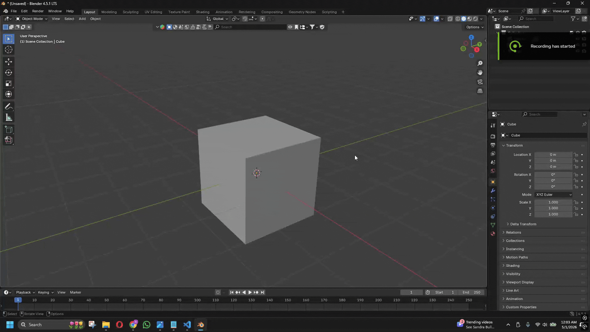

As part of the rapid prototyping process, pre-made assets are utilized to accelerate development, particularly when constructing the model’s interior. Instead of building every element from scratch, existing resources are strategically selected to save time while still achieving a coherent result. To ensure these choices remain intentional and effective, asset selection is guided by established interior design principles, allowing the prototype to maintain both structural logic and visual consistency even in its early stages.

**Resources for assets and textures:**

- [BlenderKit](https://www.blenderkit.com/)
- [SketchFab](https://sketchfab.com/)
- [CGTrader](https://www.cgtrader.com/)
- [Polligon](https://www.poliigon.com/)
- [Polyhaven](https://polyhaven.com/)

See [Scenes](#-scenes-) for the interior designs I chose.

## Ground Plane Adjustment

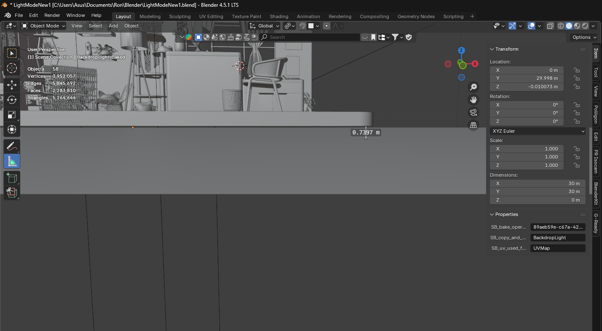

One important thing to keep in mind is applying a subtle vertical offset to the ground plane to accommodate [hoverable grid interaction](#hoverable-grid-interaction). This will ensure clear visual layering and preventing overlap between the static and interactive element. This must be accomplished in the very first process of your modeling process.

## Texture Baking

### Face Orientation
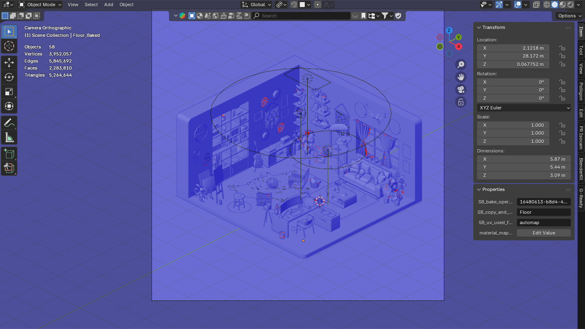

Before baking, face orientation is the most important thing you need to do in the baking process. Verify if all normals were correctly facing outward. Proper orientation or **BLUE** faces is essential for accurate texture baking, as it ensures baking rays project correctly and prevents visual artifacts such as inverted lighting or missing details. In case of **RED** faces, [flip or recalculate normals](https://www.youtube.com/watch?v=7sK2pDByXOE).

Aside from face orientation, ensure all meshes are converted to mesh with [Convert to > Mesh](https://www.youtube.com/watch?v=QDkqZajS65g). Similarly, apply [rotation and scale](https://docs.blender.org/manual/en/latest/scene_layout/object/editing/apply.html) to all objects.  

### UV Editing
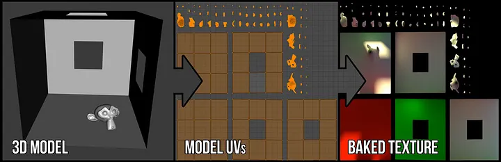

Unwrap the mesh and arrange it in a 2D structure so that textures are appropriately projected onto the surface. Proper UV organization reduces stretching, prevents overlapping, and ensures constant texture detail throughout the model. To easily work with this, I used the [G-Ready](https://faridmammadov.gumroad.com/l/G-Ready) addon with auto UV, packing, average scale islands, and other tools. 

### Bake It!
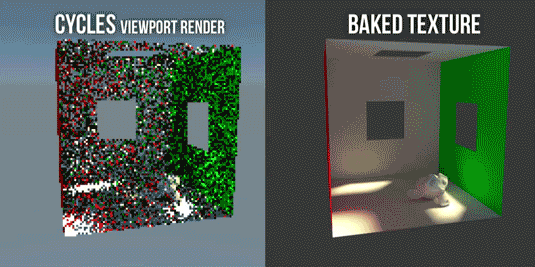

After all is set, use a good baking addon such as [SimpleBake](https://superhivemarket.com/products/simplebake---simple-pbr-and-other-baking-in-blender-2). Prepare presets from 1k - 4k. In my case, I only used 1k to 2k to prioritize the performance of the website. 

**Presets:**

- Combined Bake Type: Direct, Indirect, Diffuse, Glossy, Transmission, & Emit
- Samples: 256
- Colour Space: sRGB
- Denoise: OFF
- Bake & Output Width: 1024px or 2048px
- Bake Margin: 4px (if 1024px) or 8px (if 2048px)
- Margin Type: Adjancent Faces
- All internal 32bit float: ON
- Transparent Background: OFF
- Clear existing bake image before bake: ON
- Export Format: EXR
- Export Coded: ZIP
- Material: Principled BSDF
- Device: CPU (Use GPU if you can)
- Foreground Bake for faster baking

### Compositing
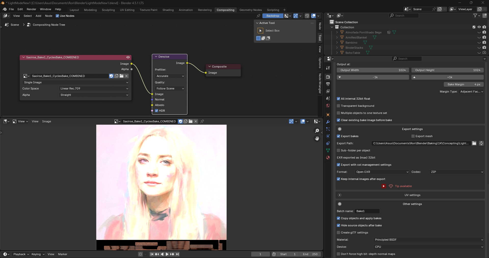

Baked textures were processed in EXR format to retain high dynamic range. Use Blender's compositor by applying the [denoise](https://docs.blender.org/manual/en/latest/compositing/types/filter/denoise.html) node to reduce noise artifacts and improve overall texture. Export using PNG as format in the denoised EXR image.

## Compression & Results
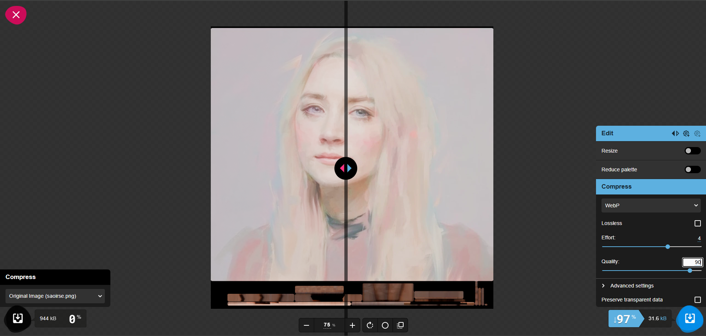

Compress your PNG bakes using [Squoosh](https://squoosh.app/). Use WebP as a format as it offers 25% to 50% smaller file sizes compared to PNG. Reducing the file size of your texture images will help improve the performance in the long run.

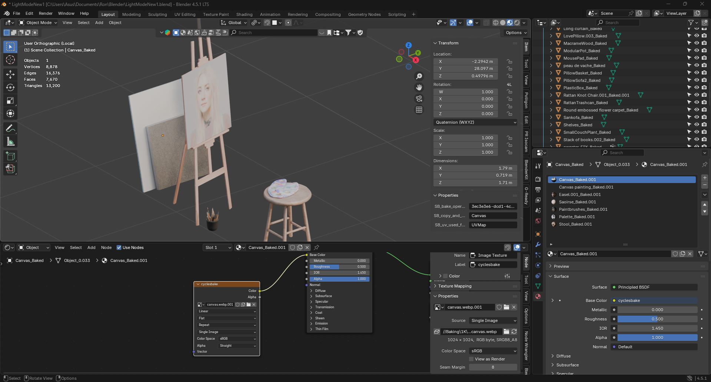

Change the current image node and use the WebP image. The assets are now fully prepared for web integration. It achieved a balance between visual realism and performance that is suitable for real-time rendering.

## Web Integration

Separate the scene into different areas (workplace area, resting area, art section, etc.) as it will be exported into separated GLB files. Join all meshes within that area and export it into the lowest material quality you like (in my case, I put 75).

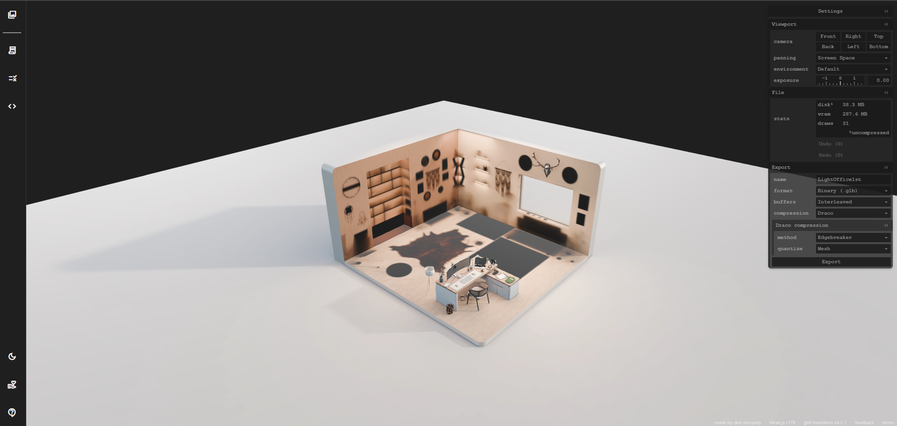

Use [glTF Report](https://gltf.report/) to apply [Draco](https://threejs.org/examples/jsm/libs/draco/) compression to the GLB file. This reduces file size and improves loading performance, which will largely contribute to the performance of your website.

To import it to your website, use [gltfjsx](https://github.com/pmndrs/gltfjsx) to convert the .glb file into a JSX component. After that, you can now work on converting each material to MeshBasic as it is MeshStandard in default. Putting version number in the command is **NOT** necessary. In my case, the command didn't work without version number so I put one. For this, I use version 6.5.3.

```
npx gltfjsx Model.glb
```
or

```
npx gltfjsx @version Model.glb
```

## Retopology

There are cases where a mesh may appear visually inconsistent or overly complex when integrated into a web environment. In addition, high polygon counts can lead to increased memory usage and reduced performance. To address these issues, retopology is applied to simplify geometry while preserving the overall shape and visual quality of the model, which makes it more suitable for real-time rendering. 

The following techniques can be applied depending on the specific issue encountered:

### Decimate
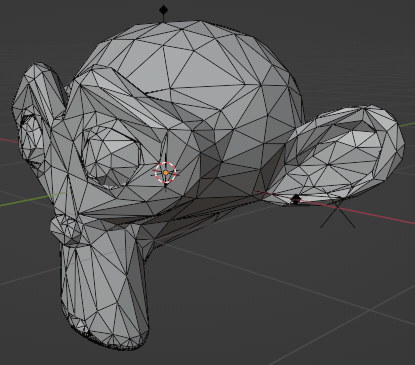

A modifier that reduces polygon count by simplifying the mesh while maintaining its general form. This is useful for optimizing complex models that do not require high geometric detail in real-time applications.

### Unsubdivide
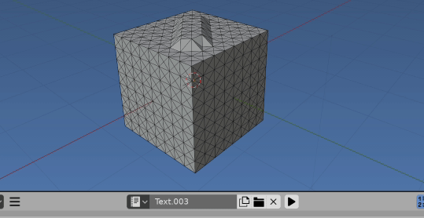

Simplifies topology by reversing subdivision patterns, producing a cleaner and more uniform mesh. This helps maintain structure while reducing unnecessary geometry.

### Asset Swapping

Replaces high-poly or complex models with lower-poly alternatives that are more suitable for real-time rendering. This approach ensures better performance while preserving the visual intent of the scene. You can find asset alternatives to the resources I listed in [rapid prototyping](#rapid-prototyping).

## Modeling the Targets 


(Photo from the old Dark Scene model)

In the [hoverable targets](#hoverable-targets) feature, to be able to trigger a scaling animation, I modeled the base with a cube displayed in view port as bounds with small extruded cubes (extrude under, left, and right faces, making it look like a "T" shape) on each side. Set geometry to origin so that when the scaling animation is coded, the cube is expected to shrink/expand starting from the middle of the mesh. Apply to all desired areas.

## Scene Transition Overview

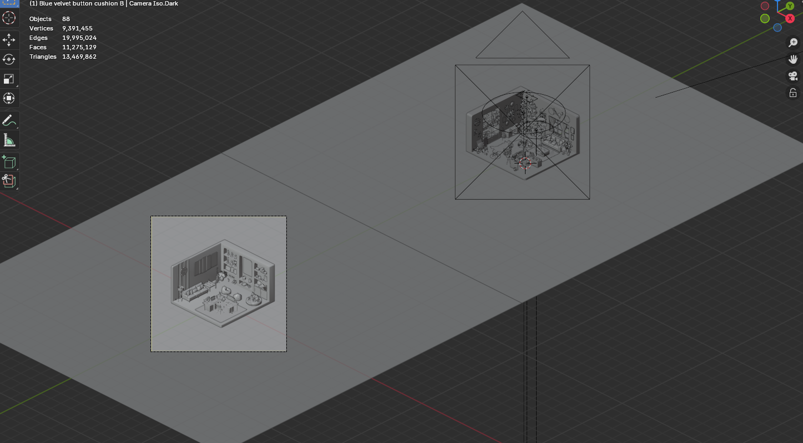

To explain the feature in the most simplest way.

The [scene transition](#scene-transition) is handled through controlled movement of an orthographic camera between predefined positions. Each scene (e.g., light and dark) has a specific set of coordinates (x,y,z) that serves as the camera’s target location. When a trigger (such as a button) is activated, the camera is programmatically translated from its current position toward the target coordinates. The movement continues until the camera reaches this exact position, effectively switching the user’s view from one scene to another.

This approach keeps the transition logic simple rather than loading or swapping scenes. The system reuses a single camera and moves it back and forth between two fixed points. The reverse transition follows the same process, returning the camera to its original coordinates.

To maintain visual smoothness, an overlay is temporarily applied during the camera movement. This prevents users from noticing any stutter or intermediate rendering inconsistencies, ensuring that the transition feels seamless and controlled.

This will also explain how important it is to ensure that each object is placed at its precise position before exporting. The image above shows how your scenes will look after export. Referring back to [Web Integration](#web-integration), you will be exporting your assets into separate sections, so accuracy is essential since this will serve as your reference for organizing the scene structure

# 🚀 Future Improvements 🚀
- Even though it is normal for the website to obtain a high memory usage, it uses **2.5gb** which is moderately high. It would be much better if the tab uses only **1gb** to maximize the performance.
- The main reason the website uses high memory usage is due to the complexity of the models of each scenes. One key mistake I had done here is I modeled the scene without considering how it will perform when integrated. I got carried away putting too much polygon counts on each scenes such as too much objects/details in one area. In future versions, I might settle for an in-depth retopology to further improve the performance if time allows.
- Texture compression is another area for improvement. Implementing [KTX2](https://github.khronos.org/KTX-Specification/ktxspec.v2.html) could significantly reduce texture size and memory usage which will improve performance.
- **Mobile support** is not yet optimized. Expanding compatibility for mobile devices will be an important step to improve accessibility and reach.
- Adding an optional **audio system** could enhance immersion. This allows users to toggle background sound or ambient effects on and off based on their preference.
- **Additional object movements and environmental animations** could make the scene feel more alive.
- The quick menu remains accessible even when a section is open, but transitions between sections are currently abrupt. Navigating to another section simply replaces the content without a **visual transition**. Adding a **close-and-open transition** between sections could improve flow and make the experience feel more cohesive.

# 🙌 Acknowledgements / Inspiration 🫶

This project was largely inspired by the works of [Andrew Woan](https://github.com/andrewwoan), especially in the way he approaches interactive 3D experiences on the web. Seeing how immersive environments can be combined with web development pushed me to explore beyond traditional portfolio formats and experiment with creating something more engaging and spatial. His work splayed a big role in shaping the direction and vision of this project. I’m also thankful for the techniques and ideas I was able to learn from his works. It contributed substantially to the overall execution and success of the project.

I’d also like to acknowledge my friends and family for their constant support throughout the development process. Whether it was through feedback, encouragement, or simply being patient during long development hours, they played an important role in helping me stay motivated and continue improving the project.

Special thanks to [Chester Gulmatico](https://www.linkedin.com/in/chester-gulmatico/) for helping with quality assurance and identifying issues I initially overlooked, such as missing refresh handling in the Vercel deployment and other edge cases. His feedback contributed to improving the stability and overall reliability of the application.

Lastly, both the Blender Community and the Three.js community have been invaluable resources throughout this project. From tutorials and shared workflows to problem-solving discussions, they helped me better understand real-time rendering, optimization techniques, how to bring 3D experiences effectively into the web environment, and all other things I need to work on for the success of the project.
