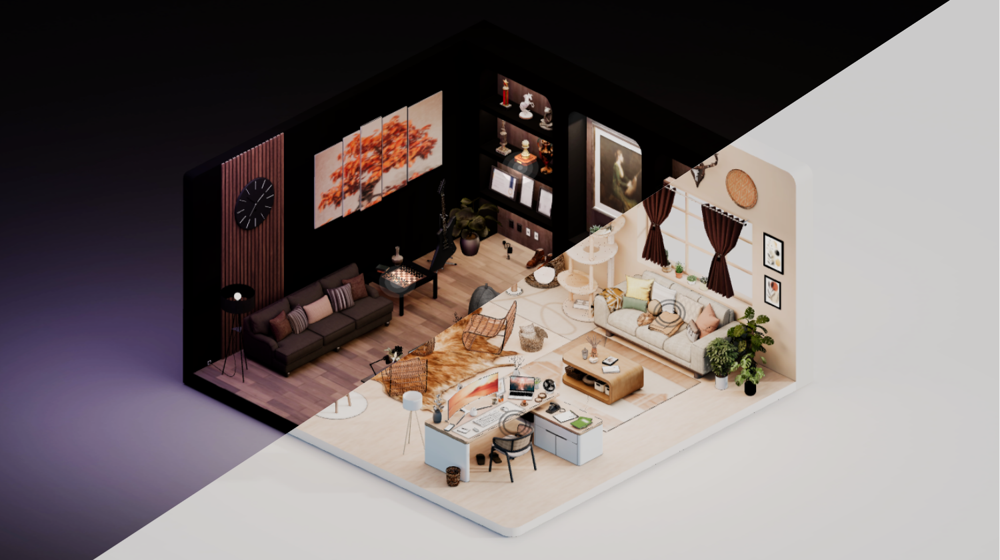
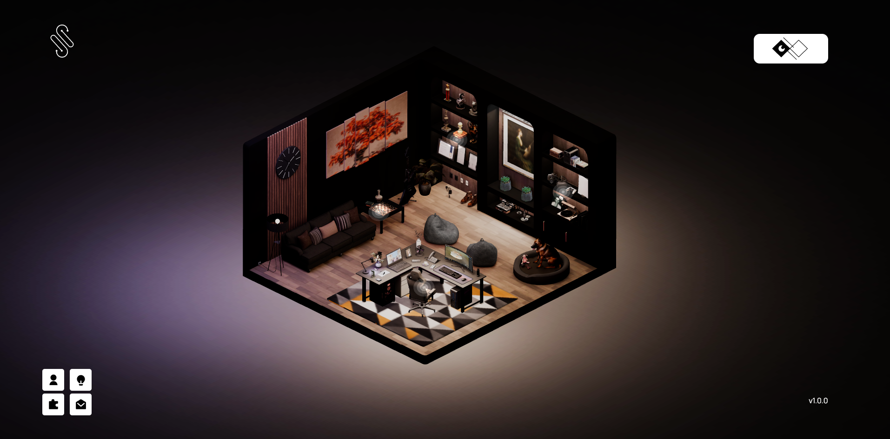
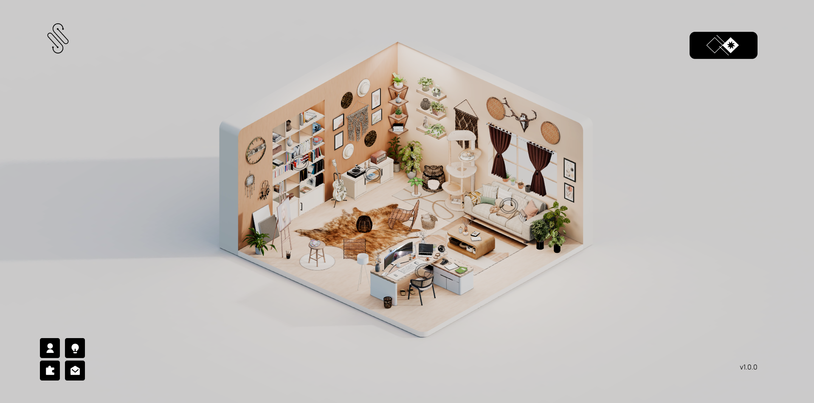
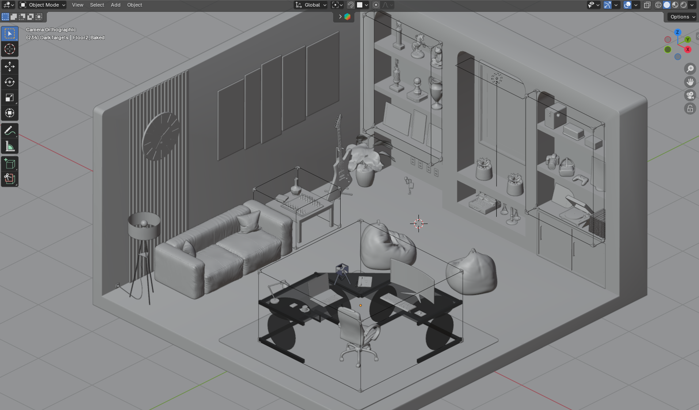

# Spectron — a 3D Interactive Web Portfolio

This repository contains the source code, assets, and documentation for Spectron. Feel free to explore the project, review the implementation, and provide feedback 🫶

**[Live Website](https://spectron-website-portfolio.vercel.app/)**

Version: 1.0.0

# Table of Contents
* [About Spectron](#about-spectron)
* [Scenes](#-scenes-)
* [Features](#-features-)
* [Tech Stack](#-tech-stack-)
* [Device Compatibility](#-device-compatibility-%EF%B8%8F)
* [Performance](#-performance-)
* [3D Production Pipeline](#-3d-production-pipeline-%E2%80%8D)
* [Future Improvements](#-future-improvements-)
* [Acknowledgements / Inspiration](#-acknowledgements--inspiration-)

# About Spectron

Spectron is a 3D portfolio built with React, Three.js, and GSAP, where users can navigate through an interactive 3D environment to view my background, skills, experience, and contact details. Instead of presenting information in a linear format, the project allows users to explore content spatially, making the experience more engaging and memorable. The application features two switchable scenes, Dark and Light, designed to reflect the familiar experience of toggling between dark mode and light mode in everyday applications.

# 🖤 Scenes 🤍

One of the most important principles in Web Development is user experience. Every decision is made to guide, engage, and support the user effectively, especially in design. This intentionality ensures that a digital environment feels intuitive rather than erratic, reflecting how we curate our physical world. Just as a developer optimizes a virtual interface to maximize user flow, the organization of our physical environment influences our mental well-being.

Interior design has a psychological impact on daily life by influencing mood, behavior, and mental health through environmental factors such as lighting, color, and layout. That is why I decided to design both scenes based on real-world interior designs, because it bridges the gap between digital interaction and human emotion, ensuring the viewer feels grounded in a space that is not only functional but also psychologically resonant.

## Dark 

This presents a modern and moody interior workspace, designed with a strong emphasis on atmosphere, personality, and organized aesthetic. It blends elements of contemporary, industrial, and minimalist design to create a space that feels both structured and expressive.

Modern-moody interiors embrace depth, contrast, and intentional lighting, resulting in environments that feel focused, immersive, and refined. Dark offers a sense of calm and introspection that allows details and textures to stand out with subtle intensity.

## Light 

This showcases a modern-bohemian interior, designed with natural textures, warm tones, and curated details that reflect creativity and comfort. The scene combines aspects of contemporary design with organic and artisanal inspirations to create a room that is both expressive and welcoming.

Modern-bohemian interiors embrace openness, light, and warmth, resulting in spaces that feel both creative and refined. Light offers a bright and welcoming atmosphere that highlights balance, adaptability, and aesthetic versatility.

# ✨ Features ✨

## Loading Screen

This provides a smooth entry experience by displaying a loading progress while assets are initializing. Once complete, it transitions into the scene following up with introductory texts with fade in & out animations to improve the overall experience.

## Hoverable Grid Interaction

Creates a trail-like effect on the ground as the cursor moves that enhances immersion and offers a sense of movement within the environment.

## Visual Indicators

Uses subtle cues and highlights to signal interactive elements. It improves usability by providing instant and intuitive feedback that reduces mental effort and guides user actions without the need for complex instructions.

## Hoverable Targets

This will signal the user that the area is clickable. It makes the user confident that their next click will be successful.

## Side Panel

If the user clicks a target, it will then animate a side panel sliding to the left showing the assigned content. All content is stored in a reusable side panel component where routing determines the content structure, while a flexible sections-based system dynamically renders images, text, icons, and forms.

## Scene Transition

This enables seamless switching between Dark and Light scenes with smooth visual transitions. It offers distinct visual atmospheres while preserving a consistent interaction experience. Additionally, adds variety to the environment, keeps users engaged, and reinforces a sense of continuity during navigation.

## Quick Menu

Provides fast access to key sections. With this, it improves the navigation within the 3D environment and allowing users to quickly reach important content without interrupting the overall experience. You can switch sections while an existing section is open.

# 🛠 Tech Stack 🛠

## [React](https://react.dev/learn)
- Build a modular and component-based user interface
- Enabling structured content management and maintainable application architecture.
- **[React Router](https://reactrouter.com/home)** for client-side routing and enabling smooth navigation between sections without full page reloads.

## [Three.js](https://threejs.org/docs/) 
- **[React Three Fiber](https://r3f.docs.pmnd.rs/getting-started/introduction)** for real-time 3D rendering and declarative scene management within React.
- **[Drei](https://drei.docs.pmnd.rs/getting-started/introduction)** for utility helpers and abstractions that simplify common 3D tasks, including hooks like useVideoTexture used in both scenes.
- Supports interactive environments, camera controls, lighting, and optimized 3D workflows within a React-based architecture

## [GSAP (GreenSock Animation Platform)](https://gsap.com/docs/v3/)
- Smooth animations and transitions
- Enhancing scene interactions and creating fluid visual feedback throughout the experience.

## [Zustand](https://zustand.docs.pmnd.rs/learn/getting-started/introduction)
- state management library used to manage global state

## [Blender](https://www.blender.org/)
- 3D modeling, asset optimization, texture baking, and scene preparation before integration into the web environment.
- Blender Version: 4.5

**Addons Used:**

- [SimpleBake](https://superhivemarket.com/products/simplebake---simple-pbr-and-other-baking-in-blender-2) 
- [BlenderKit](https://www.blenderkit.com/)
- [G-Ready](https://faridmammadov.gumroad.com/l/G-Ready)
- [Create Isocam](https://github.com/jasonicarter/create-isocam)
- [Node Wrangler](https://docs.blender.org/manual/en/latest/addons/node/node_wrangler.html)

# 💻 Device Compatibility 🖥️

- Designed primarily for **TABLET**, **LAPTOP**, and **DESKTOP** environments.
- Mobile support is currently **NOT** fully optimized.
- Performance varies depending on **DEVICE** hardware capabilities

# 📊 Performance 📈

- Maintains **~60–144 FPS** during real-time interaction
- Peaks at 144 FPS on **ASUS TUF Dash F15 (RTX 3050, i5)**

# 🎨 3D Production Pipeline 🧑‍🎨

## Rapid Prototyping

## Ground Plane Adjustment

## Texture Baking

## Compression & Exporting

## Web Integration

## Retopology

## Modeling the Targets 

In the hovering targets feature, to be able to trigger a scaling animation, I modeled multiple cubes displayed in view port as bounds as base with small extruded cubes on each side. Set geometry to origin so that when the scaling animation is coded, the cube is expected to shrink/expand starting from the middle of the mesh.

## Scene Transition Overview

# 🚀 Future Improvements 🚀

# 🙌 Acknowledgements / Inspiration 🫶
